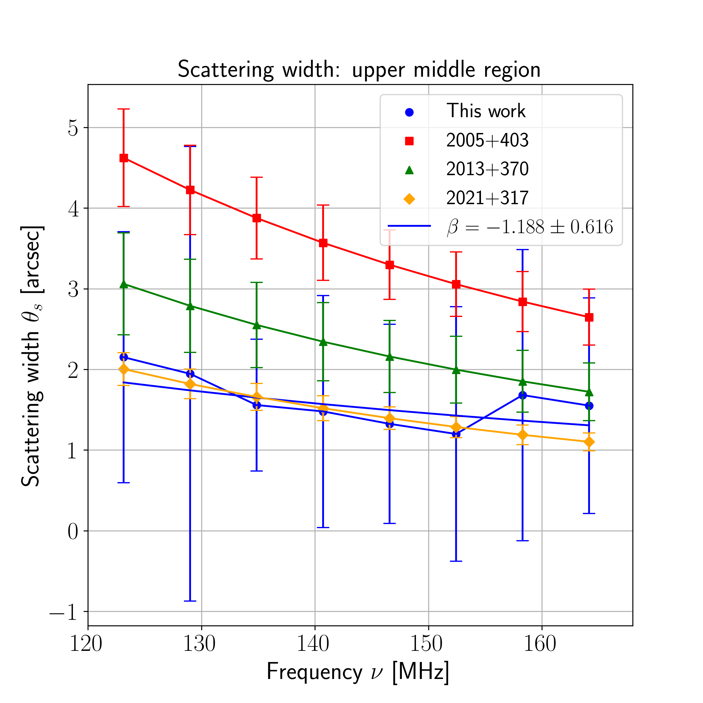

### Education

M.Sc Astronomy and Data Science, Leiden University  
B.Tech Aerospace Engineering, Indian Institute of Technology Madras  

### Research Projects

#### **Emulating a photodissociation region (PDR) code with deep learning (2nd master's thesis)**

In this work, I developed and trained a deep learning architecture based on Neural Ordinary Differential Equations (NeuralODE) to mimic/emulate the performance of an astrochemical modelling code, `3DPDR`. The network evaluates chemistry in photodissociation regions (PDR) about ~17000 times faster, and produces accurate predictions for many chemical species and temperatures. For more details, click here.

#### **Interstellar Broadening with LOFAR (1st master's thesis)**
In this work, I measured the interstellar scattering effect that causes poorer resolution (broadening) of astronomical images at radio frequencies. I  found that broadening reduces with increasing radio frequencies, as expected. For more details, click here. 

### Course projects

#### **Policy-based Reinforcement Learning**

#### **Value-based Reinforcement Learning**

#### **CAntenna: An L-Band paint can interferometer**

#### **Betelgeuse's expanding Oort cloud: an interstellar threat?**

## Outreach