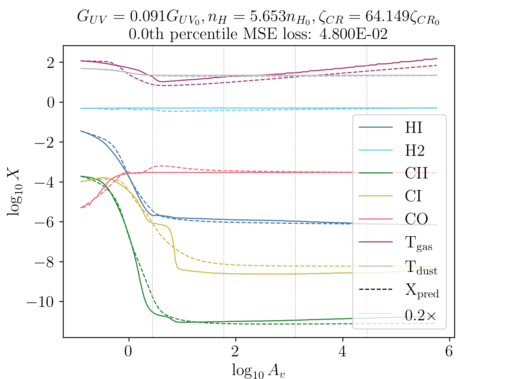

# Portfolio

### Education

M.Sc Astronomy and Data Science, Leiden University  
B.Tech Aerospace Engineering, Indian Institute of Technology Madras  

### Research Projects

#### Emulating a photodissociation region (PDR) code with deep learning (2nd master's thesis)

In this work, I developed a deep learning architecture based on Neural Ordinary Differential Equations (NeuralODE) to mimic/emulate the performance of an astrochemical modelling code, `3DPDR`. The network evaluates chemistry about ~17000 times faster, and produces accurate predictions for many chemical species and temperatures. For more details, click here.

## Outreach