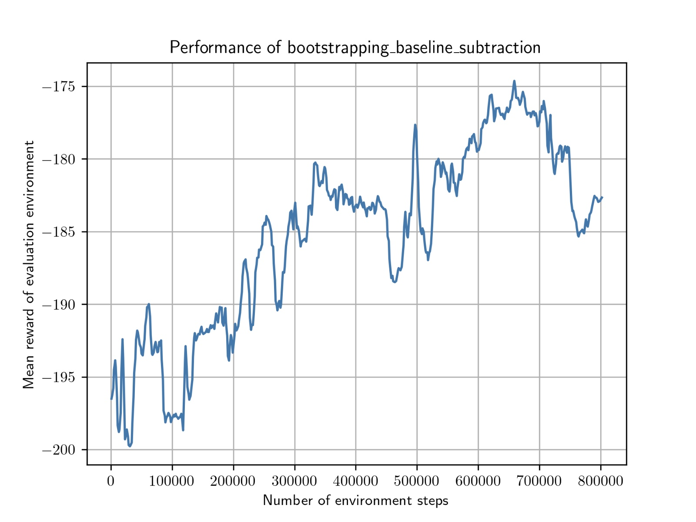

Welcome to my website. This shows a summary of my projects, and some important visualisations I generated from my projects.

## Research Projects

### **Emulating a photodissociation region (PDR) code with deep learning (2nd master's thesis)**

In this work, I developed and trained a deep learning architecture based on Augmented Neural Ordinary Differential Equations (ANODE) to mimic/emulate the performance of an astrochemical modelling code, `3DPDR`. The network evaluates chemistry in photodissociation regions (PDR) about ~17000 times faster, and produces accurate predictions for many chemical species and temperatures. For more details, check the project's [GitHub page](https://github.com/uclchem/neuralpdr).

<figcaption>Above: Video showing the training process of the neural network-based emulator. The video shows predictions vs true abundances of different chemical species as a function of position. The solid lines are the outputs from 3DPDR and the dashed lines are outputs from the deep learning-based emulator. As the number of epochs increase, the predictions match better with the ground truths.</figcaption>

Above: A 2D histogram showing the predicted and ground truth abundances of different chemical species ($\text{H}$, $\text{H}^+$, $\text{C}^+$, $\text{C}$, $\text{CO}$) and temperatures ($\text{T}_{\text{gas}}$, $\text{T}_{\text{dust}}$).

## Course projects

#### **Acrobot: Policy-based Reinforcement Learning**
In this project, my team and I implemented the REINFORCE and different variants of the Actor-Critic policy-based RL algorithms. We evaluate their performance using the Acrobot environment in Gymnasium. We found that actor-critic in combination with bootstrapping and baseline subtraction provides a high mean reward compared to REINFORCE or plain vanilla Actor-Critic, as expected. For more details, check the project's [GitHub page](https://github.com/rahulpriyadarshan19/policy-based-rl).

#### **Cartpole: Value-based Reinforcement Learning**
In this project, my team and I implemented variants of Q-Learning, an off-policy value-based RL algorithm, and evaluated its performance on the Cartpole environment in Gymnasium. We found that the DQN algorithm, i.e. Q-Learning implemented with a replay buffer and a target network performs best, as expected.

#### **Betelgeuse's expanding Oort cloud: an interstellar threat?**

In this project, my team and I ran multi-scale gravitational N-body simulations to compute the orbits of asteroids in the potential of the Milky Way galaxy, with the assumption that their host star (Betelgeuse) explodes in a supernova. We performed a statistical analysis on the asteroid orbits to find that there is only a $1$ in $1.48\times10^{13}$ possibility of an asteroid hitting Earth. For more details, check the project's [GitHub page](https://github.com/jaspermens/SMA-Betelgeuse). 

